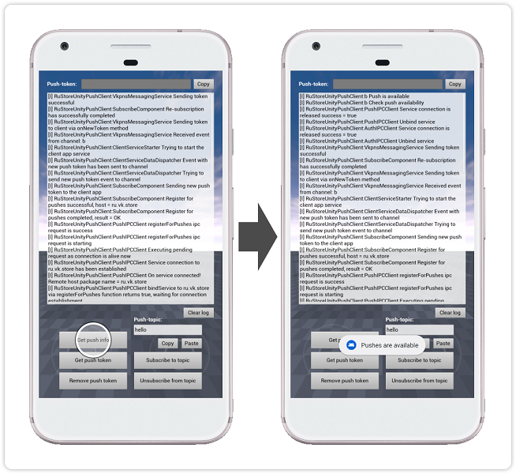
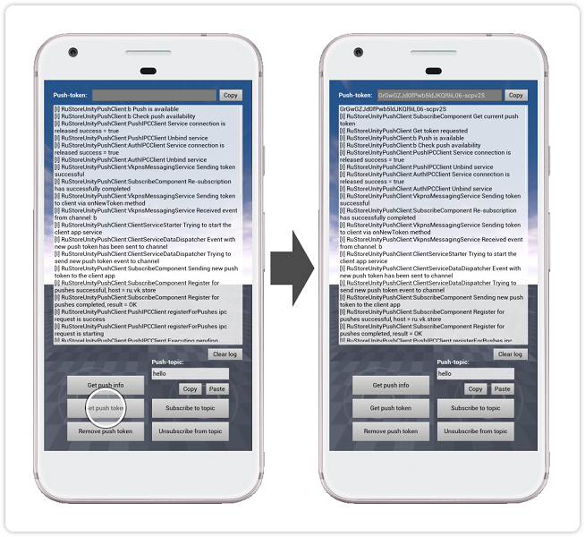

## RuStore Unreal Engine плагин для подключения пуш-уведомлений

### [🔗 Документация разработчика][10]

- [Условия работы push-уведомлений](#Условия-работы-push-уведомлений)
- [Подготовка требуемых параметров](#Подготовка-требуемых-параметров)
- [Настройка примера приложения](#Настройка-примера-приложения)
- [Сценарий использования](#Сценарий-использования)
- [Условия распространения](#Условия-распространения)
- [Техническая поддержка](#Техническая-поддержка)

### Условия работы push-уведомлений

Для работы push-уведомлений необходимо соблюдение следующих условий:

1. На устройстве пользователя должно быть установлено приложение RuStore.

2. Приложение RuStore должно поддерживать функциональность push-уведомлений.

3. Приложению RuStore разрешен доступ к работе в фоновом режиме.

4. Пользователь должен быть авторизован в приложении RuStore.

5. Отпечаток подписи приложения должен совпадать с отпечатком, добавленным в Консоль RuStore.

### Подготовка требуемых параметров

Для корректной настройки примера приложения необходимо подготовить следующие данные:

1. `projectId` - ID push-проекта из консоли разработчика RuStore. Необходим для формирования push token и [отправки push-уведомлений](https://www.rustore.ru/help/sdk/push-notifications/send-push-notifications) (пример: https://console.rustore.ru/apps/_“your_account_id”_/push/projects/-Yv4b5cM2yfXm0bZyY6Rk7AHX8SrHmLI, `projectId` = -Yv4b5cM2yfXm0bZyY6Rk7AHX8SrHmLI).

2. `applicationId` - уникальный идентификатор приложения в системе Android в формате обратного доменного имени (пример: ru.rustore.sdk.example).

3. `*.keystore` - файл ключа, который используется для [подписи и аутентификации Android приложения](https://www.rustore.ru/help/developers/publishing-and-verifying-apps/app-publication/apk-signature/).

### Настройка примера приложения

Для проверки работы приложения вы можете воспользоваться функционалом [API для отправки push-уведомлений](https://www.rustore.ru/help/sdk/push-notifications/send-push-notifications)

1. В файле ресурсов “Source / RuStorePushApp / projectid.xml” в параметре “rustore_app_id” укажите consoleApplicationId из консоли разработчика RuStore.

2. В настройках проекта (Edit → Project Settings → Platforms → Android) в поле “Android Package Name” укажите applicationId - код приложения из консоли разработчика RuStore.

3. В настройках проекта (Edit → Project Settings → Platforms → Android) в разделе “Distribution Signing” укажите расположение и параметры ранее подготовленного файла *.keystore.

### Сценарий использования

#### Проверка доступности работы с push-уведомлениями

Тап по кнопке `Get push info` выполняет [проверку возможности получения push-уведомления][20]. Результат проверки выводится в лог на экране.

#### Получение push-токена пользователя

Тап по кнопке `Get push token` выполняет процедуру [получения текущего push-токена пользователя][30]. Push-токен пользователя, полученный в приложении, используется в структуре `message` для [отправки push-уведомлений](https://www.rustore.ru/help/sdk/push-notifications/send-push-notifications).

### Условия распространения

Данное программное обеспечение, включая исходные коды, бинарные библиотеки и другие файлы распространяется под лицензией MIT. Информация о лицензировании доступна в документе [MIT-LICENSE](../MIT-LICENSE.txt).

### Техническая поддержка

Дополнительная помощь и инструкции доступны на странице [help.rustore.ru](https://help.rustore.ru/) и по электронной почте [support@rustore.ru](mailto:support@rustore.ru).

[10]: https://www.rustore.ru/help/sdk/push-notifications/unreal/6-4-0
[20]: https://www.rustore.ru/help/sdk/push-notifications/unreal/6-4-0#get-push-check
[30]: https://www.rustore.ru/help/sdk/push-notifications/unreal/6-4-0#get-push-token
